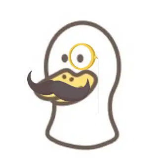

<p align="center">

<h1 align="center">odd duck</h1>
<h3 align="center">a spyfall-like game</h3>
<p align="center">"odd duck out"</p>
</p>

## Table of Contents
- [Table of Contents](#table-of-contents)
- [Website URL](#website-url)
- [Project description](#project-description)
- [Installation](#installation)
  - [Dependencies](#dependencies)


## Website URL
- TBD

## Project description
a spyfall like game


## Installation
```
npm i
```

### Dependencies
```txt
shadcn
howler
socket.io
```